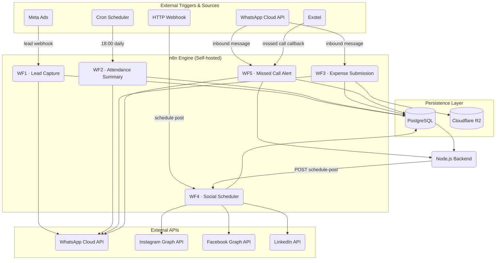

# flowwire

Production-ready [n8n](https://n8n.io) workflow automations for a modern business management system. All workflows are fully exportable and importable into any self-hosted or cloud n8n instance.

---

## Project Overview

This project demonstrates five end-to-end automation workflows that integrate WhatsApp (via Meta Cloud API), Meta Ads, PostgreSQL, Cloudflare R2, Instagram, Facebook, LinkedIn, and Exotel — all orchestrated through n8n. The workflows are designed to slot into a Node.js backend and can be deployed locally using the included Docker Compose stack.

---

## Workflows at a Glance

| # | Workflow | Trigger | Key Integrations |
|---|----------|---------|-----------------|
| 1 | **Lead Capture** | Meta Ads Webhook | Meta Ads → PostgreSQL → WhatsApp |
| 2 | **Attendance Summary** | Daily Cron (6 PM) | PostgreSQL → Aggregate → WhatsApp |
| 3 | **Expense Submission** | WhatsApp Media Message | WhatsApp → Cloudflare R2 → PostgreSQL |
| 4 | **Social Media Scheduler** | HTTP Webhook | Instagram · Facebook · LinkedIn APIs |
| 5 | **Missed Call Alert** | Exotel Webhook | Exotel → WhatsApp Callback |

---

## Architecture Summary



---

## Quickstart

### Prerequisites
- Docker & Docker Compose
- An n8n account or self-hosted instance
- API credentials (see [docs/SETUP.md](docs/SETUP.md))

### 1. Clone & Start

```bash
git clone https://github.com/<your-username>/n8n-business-automation.git
cd n8n-business-automation
cp .env.example .env          # fill in your credentials
docker compose up -d
```

n8n will be available at **http://localhost:5678**.

### 2. Import Workflows

1. Open n8n → **Workflows** → **Import from File**
2. Select any `.json` file from the `workflows/` directory
3. Configure the credential placeholders (marked with `⚙ CONFIGURE`) in each node
4. Activate the workflow

Detailed import instructions: [docs/SETUP.md](docs/SETUP.md)

### 3. Connect Your Backend

See [docs/INTEGRATION.md](docs/INTEGRATION.md) for how each workflow exposes webhook endpoints and emits events to your Node.js service.

---

## Repository Structure

```
n8n-business-automation/
├── workflows/
│   ├── 01-lead-capture-meta-ads.json
│   ├── 02-attendance-summary.json
│   ├── 03-expense-submission.json
│   ├── 04-social-media-scheduler.json
│   └── 05-missed-call-alert.json
├── docs/
│   ├── WORKFLOWS.md       — detailed per-workflow documentation
│   ├── SETUP.md           — Docker + credential setup guide
│   ├── INTEGRATION.md     — Node.js backend integration guide
│   └── DATA_FLOW.md       — ASCII data-flow diagrams
├── docker-compose.yml
├── .env.example
└── README.md
```

---

## Documentation

| Doc | Description |
|-----|-------------|
| [WORKFLOWS.md](docs/WORKFLOWS.md) | Trigger, steps, and outcome for every workflow |
| [SETUP.md](docs/SETUP.md) | Self-host n8n with Docker, configure all credentials |
| [INTEGRATION.md](docs/INTEGRATION.md) | Connect workflows to a Node.js backend |
| [DATA_FLOW.md](docs/DATA_FLOW.md) | Mermaid data-flow diagrams for every workflow |

---

## Tech Stack

- **Automation**: [n8n](https://n8n.io) (self-hosted)
- **Database**: PostgreSQL 15
- **Messaging**: WhatsApp Cloud API (Meta)
- **Storage**: Cloudflare R2 (S3-compatible)
- **Telephony**: Exotel
- **Social**: Instagram Graph API · Facebook Graph API · LinkedIn API
- **Container**: Docker Compose

---

## License

MIT — free to use and adapt for your own projects.
