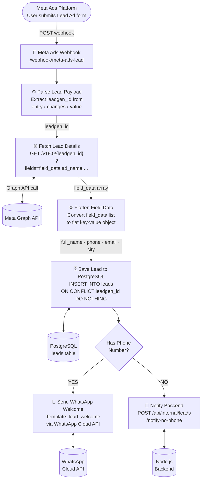
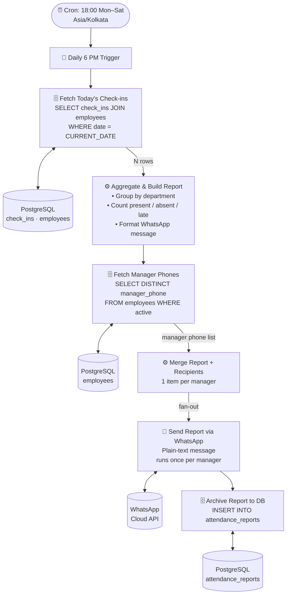
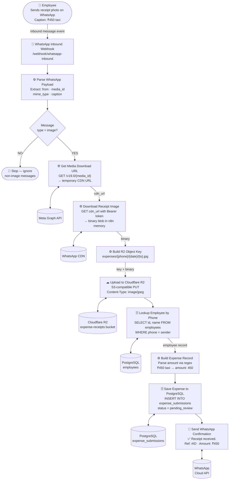
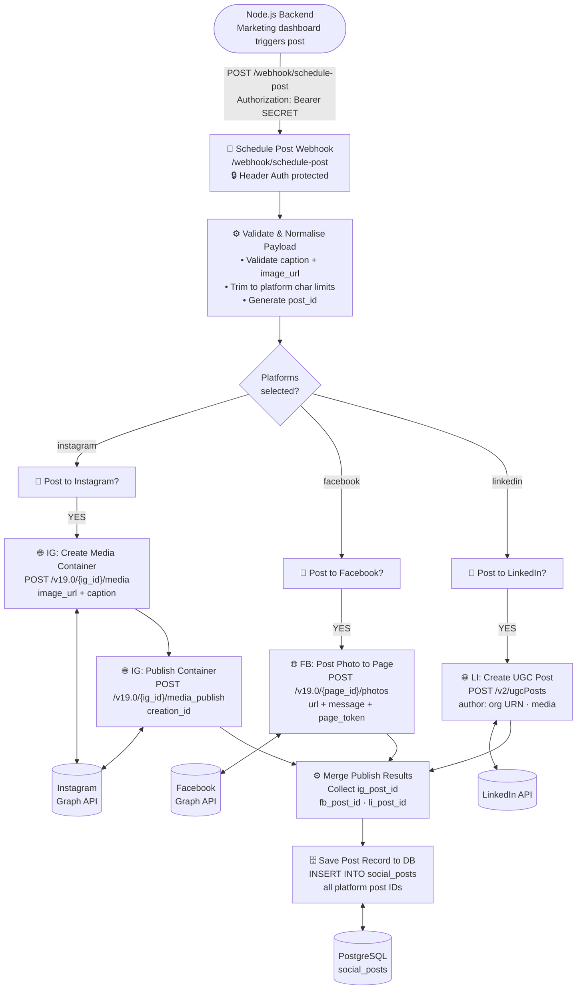
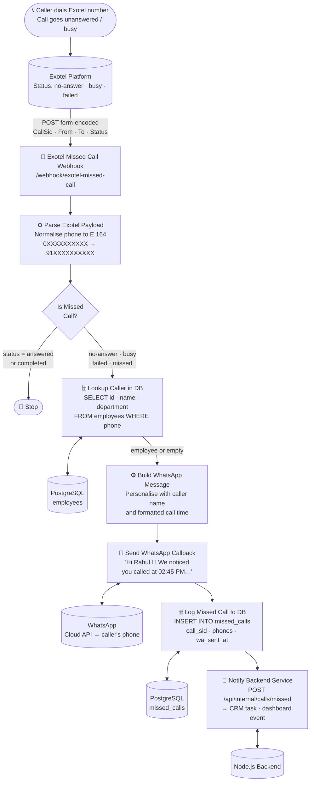
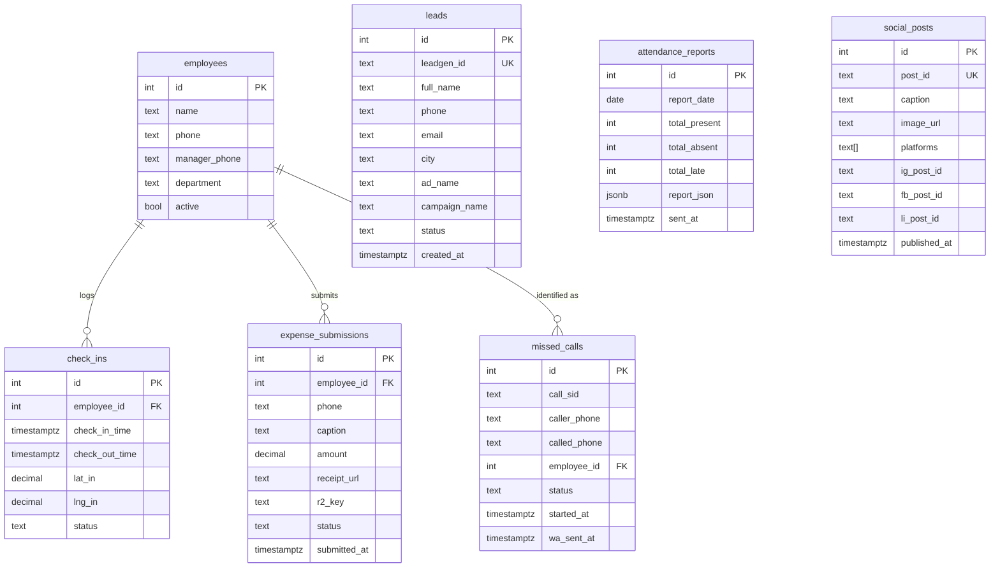
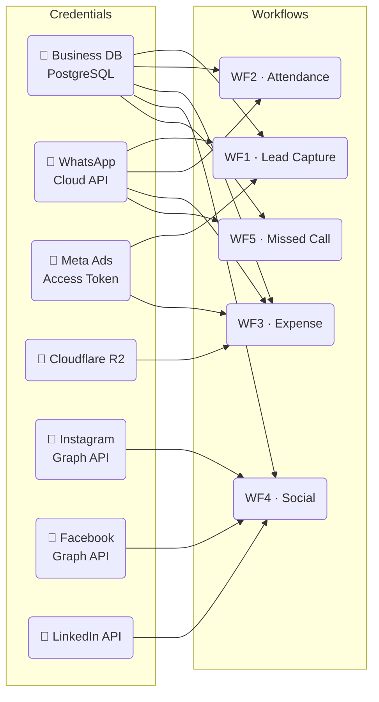

# Data Flow Diagrams

Mermaid diagrams showing how data moves through each of the five automation workflows.

---

## Workflow 01 — Lead Capture



---

## Workflow 02 — Attendance Summary



**Sample WhatsApp output:**

```
📋 Attendance Report — 15 Jan 2024
━━━━━━━━━━━━━━━━━━━━━━
✅ Present : 28  ❌ Absent : 4  ⏰ Late : 3

*Sales* (P:10 A:1 L:2)
  ✅ Aditya Kumar — In: 09:02 | Out: 18:30 | 9.47h
  ⏰ Priya Sharma — In: 09:45 | Out: 18:15 | 8.5h
```

---

## Workflow 03 — Expense Submission



---

## Workflow 04 — Social Media Scheduler



**Instagram requires a two-step publish** — container creation then publish — which this workflow handles sequentially before merging with the other branches.

---

## Workflow 05 — Missed Call Alert



**End-to-end latency:** typically under 3 seconds from missed call detection to WhatsApp delivery.

---

## Cross-Workflow Data Relationships



---

## Credential Sharing Map


