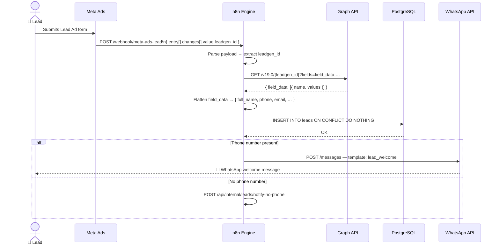
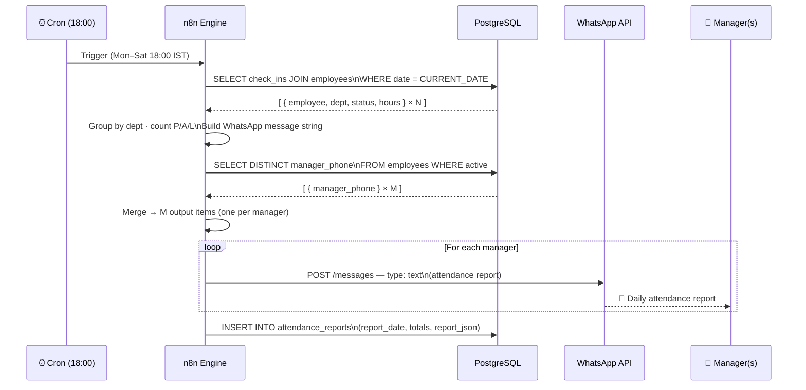
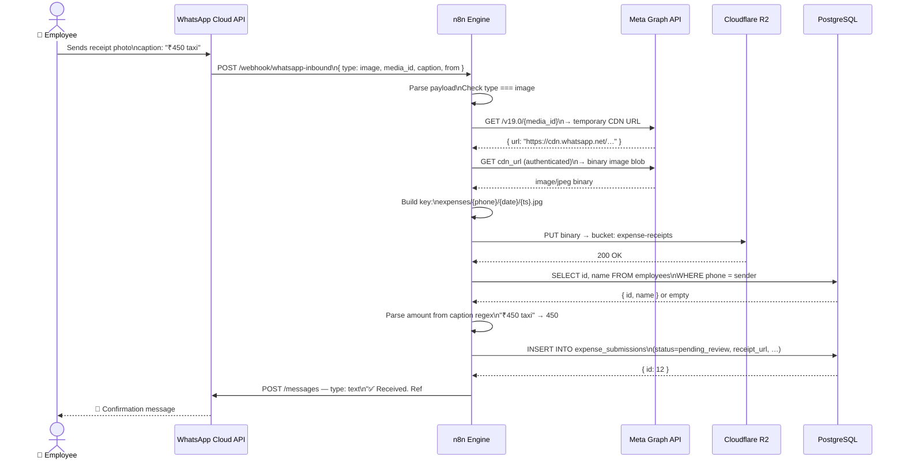
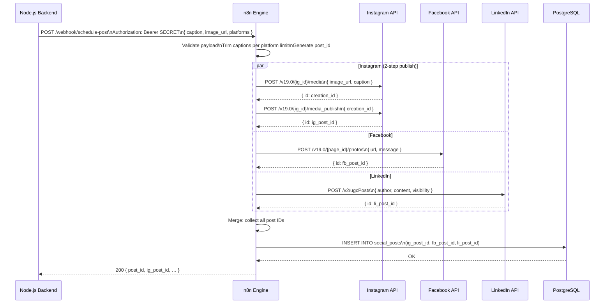
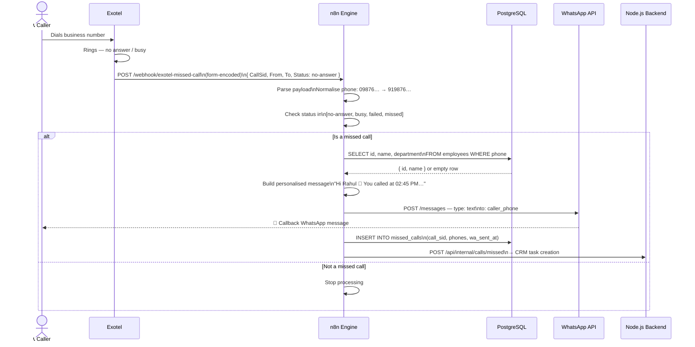

# Workflow Documentation

Detailed reference for each of the five n8n automation workflows included in this project.

---

## Table of Contents

1. [Lead Capture — Meta Ads → PostgreSQL → WhatsApp](#1-lead-capture--meta-ads--postgresql--whatsapp)
2. [Attendance Summary — GPS Check-ins → WhatsApp Report](#2-attendance-summary--gps-check-ins--whatsapp-report)
3. [Expense Submission — WhatsApp Photo → Cloudflare R2 → PostgreSQL](#3-expense-submission--whatsapp-photo--cloudflare-r2--postgresql)
4. [Social Media Scheduler — Webhook → Instagram · Facebook · LinkedIn](#4-social-media-scheduler--webhook--instagram--facebook--linkedin)
5. [Missed Call Alert — Exotel → WhatsApp Callback](#5-missed-call-alert--exotel--whatsapp-callback)

---

## 1. Lead Capture — Meta Ads → PostgreSQL → WhatsApp

**File:** `workflows/01-lead-capture-meta-ads.json`

### Purpose
Automatically captures leads generated from Meta (Facebook/Instagram) Lead Ads, persists them to PostgreSQL, and immediately sends a personalised WhatsApp welcome message to the lead.

### Trigger
- **Type:** HTTP Webhook (`POST /webhook/meta-ads-lead`)
- **Source:** Meta Ads Lead Ads webhook (fires when a user submits a Lead Ad form)
- **Verification:** Meta sends a `GET` ping with a `hub.challenge` token on initial setup — the webhook responds automatically

### Flow Diagram



### Nodes & Steps

| # | Node | Action |
|---|------|--------|
| 1 | **Meta Ads Webhook** | Receives the raw Meta webhook payload |
| 2 | **Parse Lead Payload** | Extracts `leadgen_id` from `entry[].changes[]` where `field === 'leadgen'` |
| 3 | **Fetch Lead Details from Graph API** | Calls `GET /v19.0/{leadgen_id}?fields=field_data,…` to retrieve full form responses |
| 4 | **Flatten Field Data** | Converts `field_data` array `[{ name, values }]` to a flat key-value object |
| 5 | **Save Lead to PostgreSQL** | `INSERT` into `leads` table with `ON CONFLICT (leadgen_id) DO NOTHING` |
| 6 | **Has Phone Number?** | IF branch — checks whether `phone` field was captured |
| 7a | **Send WhatsApp Welcome** | Sends an approved `lead_welcome` template message via WhatsApp Cloud API |
| 7b | **Notify Backend — No Phone** | POSTs to the Node.js backend for manual follow-up when no phone is available |

### Key Fields Captured

```
leadgen_id · full_name · phone · email · city
ad_name · campaign_name · form_id · created_at · status
```

### Outcome
- Lead is durably stored in PostgreSQL within seconds of form submission
- Lead receives a WhatsApp welcome message before a human even opens a CRM
- Backend is notified when a phone number is missing so a human can follow up

### Required Credentials
| Credential Name | Type | Notes |
|---|---|---|
| `Meta Ads Access Token` | HTTP Header Auth | `Authorization: Bearer <LONG_LIVED_TOKEN>` |
| `WhatsApp Cloud API` | HTTP Header Auth | `Authorization: Bearer <ACCESS_TOKEN>` |
| `Business DB — PostgreSQL` | Postgres | Host/port/db/user/pass |

### Meta Webhook Setup
1. Go to **Meta for Developers** → your App → **Webhooks**
2. Subscribe to the `leadgen` field on the **Page** object
3. Set the Callback URL to `https://<n8n-host>/webhook/meta-ads-lead`
4. Set `WHATSAPP_VERIFY_TOKEN` in your `.env` and paste the same value as the Verify Token in Meta's dashboard

---

## 2. Attendance Summary — GPS Check-ins → WhatsApp Report

**File:** `workflows/02-attendance-summary.json`

### Purpose
Every evening at 6 PM (Mon–Sat), aggregates GPS-based employee check-in / check-out records from PostgreSQL, builds a department-wise attendance report, and delivers it via WhatsApp to all active managers.

### Trigger
- **Type:** Schedule (Cron)
- **Expression:** `0 18 * * 1-6` — 18:00 every Monday through Saturday
- **Timezone:** Controlled by `GENERIC_TIMEZONE` env var (default: `Asia/Kolkata`)

### Flow Diagram



### Nodes & Steps

| # | Node | Action |
|---|------|--------|
| 1 | **Daily 6 PM Trigger** | Cron fires at 18:00 Mon–Sat |
| 2 | **Fetch Today's Check-ins** | SQL query joins `check_ins` + `employees`, filters `check_in_time::date = CURRENT_DATE` |
| 3 | **Aggregate & Build Report** | Groups by department; counts present / absent / late; formats multi-line WhatsApp message |
| 4 | **Fetch Manager Phone Numbers** | Queries distinct `manager_phone` from active employees |
| 5 | **Merge Report + Recipients** | Cross-joins report data with each manager phone (one item per recipient) |
| 6 | **Send Report via WhatsApp** | Sends plain-text message to each manager; runs once per manager (split-item processing) |
| 7 | **Archive Report to DB** | Inserts daily summary row into `attendance_reports` for historical tracking |

### Expected Database Schema

```sql
-- GPS check-in table (populated by your mobile app)
CREATE TABLE check_ins (
  id             SERIAL PRIMARY KEY,
  employee_id    INT NOT NULL,
  check_in_time  TIMESTAMPTZ,
  check_out_time TIMESTAMPTZ,
  lat_in         DECIMAL(10,7),
  lng_in         DECIMAL(10,7),
  lat_out        DECIMAL(10,7),
  lng_out        DECIMAL(10,7),
  status         TEXT DEFAULT 'present'  -- present | late | absent
);

CREATE TABLE employees (
  id            SERIAL PRIMARY KEY,
  name          TEXT NOT NULL,
  phone         TEXT,
  manager_phone TEXT,
  department    TEXT,
  active        BOOLEAN DEFAULT true
);
```

### Sample WhatsApp Output

```
📋 Attendance Report — 15 Jan 2024
━━━━━━━━━━━━━━━━━━━━━━
✅ Present : 28
❌ Absent  : 4
⏰ Late    : 3

*Sales* (P:10 A:1 L:2)
  ✅ Aditya Kumar — In: 09:02 | Out: 18:30 | 9.47h
  ⏰ Priya Sharma — In: 09:45 | Out: 18:15 | 8.5h
  ...
```

### Outcome
- Managers receive a structured report on their WhatsApp every evening
- Historical records preserved in `attendance_reports` table
- Zero manual intervention required

---

## 3. Expense Submission — WhatsApp Photo → Cloudflare R2 → PostgreSQL

**File:** `workflows/03-expense-submission.json`

### Purpose
Employees submit travel/expense receipts by simply sending a photo on WhatsApp with a caption like `₹450 taxi`. The workflow downloads the image, uploads it to Cloudflare R2 object storage, creates a database record, and sends a confirmation back.

### Trigger
- **Type:** HTTP Webhook (`POST /webhook/whatsapp-inbound`)
- **Source:** WhatsApp Cloud API webhook (fires on every inbound message)

### Flow Diagram



### Nodes & Steps

| # | Node | Action |
|---|------|--------|
| 1 | **WhatsApp Inbound Webhook** | Receives all inbound WhatsApp messages |
| 2 | **Parse WhatsApp Payload** | Extracts `from`, `media_id`, `mime_type`, `caption` from the message object |
| 3 | **Is Image?** | IF branch — only processes `type === 'image'`; non-image messages fall off |
| 4 | **Get Media Download URL** | Calls `GET /v19.0/{media_id}` to get the temporary CDN URL |
| 5 | **Download Receipt Image** | Downloads binary image from WhatsApp CDN (authenticated request) |
| 6 | **Build R2 Object Key** | Constructs a namespaced key: `expenses/{phone}/{YYYY-MM-DD}/{timestamp}.{ext}` |
| 7 | **Upload to Cloudflare R2** | Uploads binary using the S3-compatible node; sets correct `Content-Type` |
| 8 | **Lookup Employee by Phone** | Finds the employee record by matching sender phone number |
| 9 | **Build Expense Record** | Parses amount from caption via regex; assembles the DB row |
| 10 | **Save Expense to PostgreSQL** | Inserts into `expense_submissions` with `status = 'pending_review'` |
| 11 | **Send WhatsApp Confirmation** | Replies to the employee with a reference ID and detected amount |

### R2 Object Key Convention
```
expenses/
  919876543210/          ← sender phone (E.164 without +)
    2024-01-15/
      1705312345678.jpg  ← Unix timestamp + extension
```

### Caption Parsing
The code node uses a simple regex to extract an INR amount from the caption:
```
/(₹|Rs\.?|INR)?\s*(\d+(\.\d{1,2})?)/
```
Examples: `₹450 taxi` → `450`, `Rs. 1200 hotel` → `1200`, `lunch 320` → `320`

### Outcome
- Receipt stored durably in Cloudflare R2 (cheap, S3-compatible, no egress fees)
- Database record created immediately for finance team to review
- Employee gets instant acknowledgement with a reference ID

### Required Credentials
| Credential | Type | Notes |
|---|---|---|
| `WhatsApp Cloud API` | HTTP Header Auth | `Authorization: Bearer <ACCESS_TOKEN>` |
| `Cloudflare R2` | S3 | Endpoint: `https://<ACCOUNT_ID>.r2.cloudflarestorage.com` |
| `Business DB — PostgreSQL` | Postgres | Standard connection |

---

## 4. Social Media Scheduler — Webhook → Instagram · Facebook · LinkedIn

**File:** `workflows/04-social-media-scheduler.json`

### Purpose
A single webhook endpoint that accepts a post payload (caption + image URL + target platforms) from your Node.js backend and publishes simultaneously to Instagram, Facebook, and/or LinkedIn using their official APIs.

### Trigger
- **Type:** HTTP Webhook (`POST /webhook/schedule-post`)
- **Authentication:** Header Auth (Bearer token matching `BACKEND_API_SECRET`)
- **Source:** Your Node.js backend's post scheduling service

### Request Payload

```json
{
  "caption": "Exciting news! Our new product is live. 🚀 #launch",
  "image_url": "https://cdn.yourapp.com/posts/img123.jpg",
  "platforms": ["instagram", "facebook", "linkedin"],
  "scheduled_at": "2024-01-15T10:00:00.000Z"
}
```

### Flow Diagram



### Nodes & Steps

| # | Node | Action |
|---|------|--------|
| 1 | **Schedule Post Webhook** | Authenticated webhook receives post request |
| 2 | **Validate & Normalise Payload** | Validates required fields; trims caption per platform char limit |
| 3 | **Post to Instagram?** | IF: `platforms` contains `instagram` |
| 4 | **IG: Create Media Container** | `POST /v19.0/{ig_account_id}/media` with `image_url` + `caption` |
| 5 | **IG: Publish Container** | `POST /v19.0/{ig_account_id}/media_publish` with `creation_id` |
| 6 | **Post to Facebook?** | IF: `platforms` contains `facebook` |
| 7 | **FB: Post Photo to Page** | `POST /v19.0/{page_id}/photos` with `url` + `message` + page token |
| 8 | **Post to LinkedIn?** | IF: `platforms` contains `linkedin` |
| 9 | **LI: Create UGC Post** | `POST /v2/ugcPosts` with UGC payload targeting the LinkedIn Organization |
| 10 | **Merge Publish Results** | Collects post IDs from all branches that executed |
| 11 | **Save Post Record to DB** | Inserts into `social_posts` with all platform post IDs |

### Platform Caption Limits
| Platform | Limit | Applied In |
|----------|-------|------------|
| Instagram | 2,200 chars | `captions.instagram` |
| Facebook | 63,206 chars | `captions.facebook` |
| LinkedIn | 3,000 chars | `captions.linkedin` |

### Instagram Two-Step Publish
Instagram's Graph API requires a two-step publish process:
1. Create a media **container** (returns `creation_id`)
2. **Publish** the container using `creation_id`

This workflow handles both steps sequentially.

### Outcome
- Single API call from your backend reaches all three platforms atomically
- Per-platform post IDs stored in DB for analytics, deletion, or status tracking
- Failed platforms don't block others (branches are independent)

### Required Credentials
| Credential | Type | Notes |
|---|---|---|
| `Instagram Graph API` | HTTP Header Auth | `Authorization: Bearer <IG_ACCESS_TOKEN>` |
| `Facebook Graph API` | HTTP Header Auth | `Authorization: Bearer <PAGE_ACCESS_TOKEN>` |
| `LinkedIn API` | HTTP Header Auth | `Authorization: Bearer <LINKEDIN_ACCESS_TOKEN>` |
| `Business DB — PostgreSQL` | Postgres | Standard connection |

---

## 5. Missed Call Alert — Exotel → WhatsApp Callback

**File:** `workflows/05-missed-call-alert.json`

### Purpose
When a caller reaches an Exotel number but the call goes unanswered (missed, busy, or failed), Exotel fires a status callback to n8n. The workflow immediately sends the caller a WhatsApp message letting them know someone will call back.

### Trigger
- **Type:** HTTP Webhook (`POST /webhook/exotel-missed-call`)
- **Source:** Exotel — configured as the **Status Callback URL** in your Exotel App or Call Flow
- **Format:** `application/x-www-form-urlencoded` (Exotel standard)

### Flow Diagram



### Nodes & Steps

| # | Node | Action |
|---|------|--------|
| 1 | **Exotel Missed Call Webhook** | Receives Exotel's form-encoded status callback |
| 2 | **Parse Exotel Payload** | Extracts `CallSid`, `From`, `To`, `Status`; normalises phone to E.164 (91XXXXXXXXXX) |
| 3 | **Is Missed Call?** | IF: status is one of `no-answer`, `busy`, `failed`, `missed` |
| 4 | **Lookup Caller in DB** | Queries `employees` table to check if the caller is a known employee |
| 5 | **Build WhatsApp Message** | Personalises the callback message with caller name and call time |
| 6 | **Send WhatsApp Callback Message** | Delivers the callback message via WhatsApp Cloud API |
| 7 | **Log Missed Call to DB** | Inserts record into `missed_calls` for CRM/reporting |
| 8 | **Notify Backend Service** | POSTs event to Node.js backend for CRM task creation |

### Phone Normalisation Logic
Exotel may send phone numbers with a leading `0` or with `+91`. The Code node normalises all formats to E.164 without the `+`:
```
0XXXXXXXXXX  →  91XXXXXXXXXX
+91XXXXXXXXXX → 91XXXXXXXXXX
91XXXXXXXXXX  → 91XXXXXXXXXX (unchanged)
```

### Sample WhatsApp Message
```
Hi Rahul 👋

We noticed you called us at 02:45 PM but we couldn't connect.

A team member will call you back shortly. If it's urgent, reply to
this message and we'll prioritise your query.

— Team
```

### Exotel Configuration
1. Log in to **my.exotel.com** → **Apps**
2. Open your Passthru App or call flow
3. Set **Status Callback URL** to `https://<n8n-host>/webhook/exotel-missed-call`
4. Ensure the app triggers on `no-answer` and `busy` call states

### Outcome
- Every missed call gets an automatic WhatsApp touchpoint within seconds
- Significantly improves lead recovery rates compared to a cold call-back
- Full audit log in `missed_calls` table
